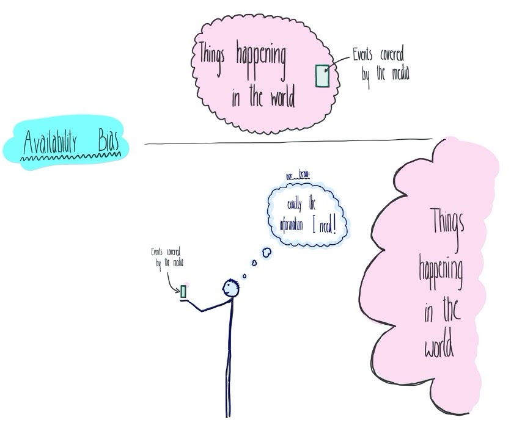

# The Availability Heuristic

Mathilda Kitzmann & John Mistele

**“Who should I vote
for?”, “Is it gonna rain later? Should I carry an umbrella with me?”,
“What should I invest into?”**

We act based on more or less serious decisions every day. With our
beliefs about uncertain events and our personal assessment of ambiguous
situations we take shortcuts for choosing quickly all the time. Our
brain uses a limited number of heuristic principles to reduce complex
judgments and ease decision making. These
heuristics can be useful and quick, as we cannot analyze and research
every small decision in our lives. At the same time, shortcuts make us
susceptible to personal biases and influences. These can limit our
neutral perspective and lead to “severe and systematic errors” (Tversky
and Kahnemann, 1974, 1124).

This chapter explores the often-applied availability heuristic. It
is the cognitive decision rule through which people judge probability
and frequency of an event or classification by availability, i.e. the
“ease with which relevant instances come to mind” (Tversky and
Kahnemann, 1973, 207). Availability heuristics can
lead to easier and quicker decisions, but can also result in biased and incorrect
judgements. This cognitive decision rule was first labeled by researchers
in psychology Amos Tversky and Daniel Kahnemann, who examined
human heuristics and biases in a series of papers. In this series they
introduced the cognitive shortcuts humans make through an assessment of
availability across ten experiments. Kahnemann and Tversky are groundbreaking researchers of cognitive
heuristics in decision making. Their pioneering role in the field of
judgement and decision making led to Kahnemann winning the Nobel Prize
in Economics in 2002, 6 years after Amos Tversky’s death.

We will look at the psychological approach to the availability heuristic
and its corresponding bias. Examples will be given for impairments of
the cognitive decision strategy an intuitionally lacking interest in
source reliability, media’s influence, and mistakes in perceived risk.
Furthermore, we will discuss a critique about our experience influencing
the heurisitc itself.

## Discovering the Availability Heuristic

The foundational studies on the Availability Heuristic
were performed by Tversky and Kahneman, published in 1973 around the
time of some of Tversky and Kahneman’s other work on cognitive biases.
Tversky and Kahneman first showed that subjects are able to accurately
assess the quantity of examples they could recall or construct (the
“available” examples) in much less time than it took them to actually
recall or construct those examples. Thus, assessments of availability
are cheap and accurate enough to be useful, assuming availability is
truly a good proxy for the real frequency or quantity of examples.

Thus the intriguing cases are where availability fails as a proxy, yet
humans still seem to use availability as the grounds for their frequency
and quantity estimates yielding predictable errors. The following
passages will summarize three such classes of tasks.

The first class of estimation tasks where the availability heuristic led
subjects astray involved mental construction. Subjects were given
the task of estimating how many ways a two-person subcommittee could be
chosen from a group of ten people, then given the task of estimating how
many ways an eight-person subcommittee could be chosen from a group of
ten people. Any two-person subcommittee corresponds to exactly one
eight-person subcommittee of all the people who were previously excluded, so
that these two quantities are mathematically identical. Despite this,
respondents systematically gave larger answers for the number of
possible two-person subcommittees than for the number of eight-person
subcommittees. Two-person subcommittees are much easier to imagine; they
somehow take up less mental space, so that such subcommittees feel more
available and thus more frequent than their eight-person counterparts.

The second class of tasks where availability distorts estimates involves
salience. Subjects in two groups were given two lists of names, one of
twenty less famous men and nineteen famous women, and one of twenty less
famous women and nineteen famous men. One group was asked to recall as
many names as they could; on average, 12.3 of 19 famous names were
recalled and only 8.4 of 20 less famous names were recalled. The other
group was asked to estimate the relative frequency of the genders in
each list; 80 of 99 study participants erroneously asserted that the
class consisting of the more famous names was more frequent. Thus, the
more salient famous examples were more easily recalled, i.e. available,
leading to an erroneous judgement of frequency.

The third class of frequency estimation error lies in distortions of the
search mechanism used. Kahneman and Tversky asked participants to judge
the relative frequency of words in English with R as the first letter
vs. R as the third letter. Despite R being more common as a third
letter, more than two thirds of participants responded that R is more
common as a first letter than as a third letter. The same effect was
observed for K, L, N, and V. This can be explained by the availability
of lexicographic orderings of words and the weight we place on first
letters; when probing the mind for words beginning with R, for many it
is clear where to look, as they have already been grouped. Not so for
third letters; thus the less available example is erroneously judged as
less frequent.

## Why and how Availability Heuristics Lead to Errors

*Fig 1: Sketched model of a person judging a
situation by the information hey can
easily retrieve, here what they are presented by media.

### Heuristics do not care about source reliability

Imagination of an event alone has an effect on our perception of reality. Due to
availability bias, simply imagining an event already leads to an
increase in our “subjective likelihood” (Carroll, 1978) for its occurrence.
While availability heuristics rely on our memory for forming an opinion
about frequency, that is also the part where our judgement is most
susceptible to errors, shortcuts and bias. This interference in our
probability judgement even occurs as we are confronted with hypothetical
or even obviously nonexistent events.

In 1978 John
Carroll published a study with two experiments showing that imagining an
event could, in itself, sufficiently lead to a person to later judge it to
be more likely. Carrol refers to work by Neisser from the same year, who
proposed similarities in psychological processes between the activity of
the brain imagining an object and directly seeing an object. In both
mechanisms, an “anticipatory schema” modifies information and
expectations, and samples the given input related to the object. In his
work, Carroll let participants imagine the event of either Ford or
Carter winning the 1976 Presidential Election. In a second experiment
participating students from the University of Pittsburgh were asked to
imagine a good or bad season for their university’s football team. The
participants were fully aware it was a highly hypothetical scenario.
After imagining the given situation, the first experiment’s participants
were asked which candidate they see to be more likely to eventually win
the election. For the second experiment the participants evaluated
first whether they thought that the football season of the given team was
going to be a “good” one and secondly, they were asked to give
predictions for a postseason bowl bid. The instructions to imagine
a specific event increased the expectation for the
imagined outcome in reality.

### Impact of the media

Information
presented by the media influences our evaluation of salience. It keeps
events present, and therefore changes our perception of recency, all
factors on which our assessment of availability depends. Even
advertising takes advantage of the availability bias. It does not matter
if we may not like the way a specific product is promoted or might even
perceive it sometimes as annoying. Still, advertisements -- even annoying
advertisements for products we dislike -- serve the role of announcing the
existence of a product. Problems about which we were unaware become
visible through ads. The next time we buy something, we can see
ourselves confronted with a problem we have an easily available solution
for, due to what we read, saw, or heard before.  Additionally,
media has a high influence on imaginability. As discussed in the
previous section, events that are presented to us, even only
hypothetically, can change our perceived likelihood of them actually
happening.

According to
cultivation theory, one of the most prominent mass communication models,
people see their social reality as more congruent with the reality
presented by television, as they spend more time consuming TV (Potter
and Riddle cited by Riddle 156). On a cognitive level, availability
heuristics can explain this effect. With a more often and recent
exposure to television, we construct easily accessible and relatable
memory and connections to possible events and occurrences. Multiple
studies see a clear correlation between the amount of TV watched and its
impact on accessibility.

Research by Karyn
Riddle (2010) has investigated the influence of TV on social reality
judgement. Participants were assigned to watch a specific television program. The
exposure to violent programs differed between the groups of
participating students in frequency, recency, and vividness. Frequency
and vividness had a strong influence on the participants’ social
beliefs. In the groups with the highest exposure to vivid violent
programs, the estimates of crime and police immorality increased
significantly. The study shows that the process of constructing
judgements about the frequency of crime and violence in society can be
influenced by the TV programs we are exposed to. In this way media
strongly influences our perception, an effect that can be seen in many
more aspects of our lives than the impact on social beliefs.

## Perceived Risk

Pioneering
research on people’s perception of risks was conducted by Paul Slovic
and Sarah Lichtenstein in 1985. They conducted a survey in which
participants were asked to judge which of two causes of death were more
frequent. Results of the study are also presented in Daniel Kahnemann’s
book *Thinking Fast and Slow*. In Slovic and Lichtenstein’s study, 80%
of participants judged accidental death as more likely than strokes,
even though strokes actually cause twice as many deaths. Tornadoes were
seen as a more frequent cause of death than asthma, although death by
asthma is 20 times as likely. Even though death by disease is 18 times
as likely as accidental death, these two were considered to be about
equally likely. Death by accidents was also judged to be more than 300
times more likely than death by diabetes, even though four times as many
people die from diabetes than they do by accidents. The study and its
results are now widely considered as a “standard example of an
availability bias” (Slovic and Liechtenstein, 1985, cited by Kahnemann
138).

These evaluations
clearly show how estimates of deaths are influenced by media coverage.
At the same time, the media do not shape what the public is interested
in. Rather, the media are biased toward the public demand for “novelty and poignancy”
(Kahnemann 138). Unusual events attract more attention than reports of
people dying of heart disease, asthma, or diabetes. Our expectations
about the frequency of occurrences are distorted by prevalence and
emotional intensity.

Availability
biases can also directly help to explain the increase in insurance
purchase and protective action after disaster. Kahnemann explains
behaviors discovered by Howard Kunreuther in research of risk and
insurance. After significant earthquakes, people in California tend to
purchase insurance and adopt measures of protection in way higher rates.
For example, they tie down their boiler to reduce a possible damage by
an earthquake and maintain emergency supplies (Kahnemann 137). However,
the memories become less present over time. Retrievability, time of
occurrence and salience become less clear.

As we see, images
of events in the past and our available memories of them shape our
expectations of the future. In this way individuals and even governments
often design protective actions adequate to the worst experienced
disaster. Already in pharaonic Egypt, societies tracked the high-water
mark of floods to be prepared for the assumedly worst possible case
(Kahnemann 137). The same still seems to be true for our modern methods
of managing safety measurements against floods. Tversky and Kahnemann
cite in their 1973 published paper the work by Robert Kates (1962), who 
pointed out a basic reliance on experience to be a major limitation to
use improved flood hazard information. Furthermore he writes, “Recently
experienced floods appear to set an upper bound to the size of loss with
which managers believe they ought to be concerned.” (Kates 140 cited by
Kahnemann and Tversky, *Availability,* 230). As Kates argues, inability
of individuals to imagine floods unlike any that have occurred is a main
restriction on efficient prevention of destruction by flood.

People’s
assessment of availability is highly susceptible to shortcuts, errors,
and biases. As discussed above, the fact that we heard, read, or
generally perceived something before, makes it appear to us to happen
more likely. It highlights the risk of bias by intense consumption of
television or even fake news or hypothetical events. Perceiving these
can change our assessment of frequency, likelihood, and finally
influence our decision making. A high perceived risk of events, which
are actually only low danger, such as chances of different causes of
death, can shift our focus to be overcautious for rationally
unreasonable events.

## Critique of the Heuristic: Experienced Ease of Recall Dominates Availability

While Kahneman and Tversky proposed
that the availability of examples is used as a means of determining the
frequency of those examples, Schwarz et al (1991) point out that
Kahneman and Tversky did not thoroughly investigate the mechanism by
which availability operates. To interrogate this, the following study
was conducted.

Schwarz et al asked two groups of subjects tho recall
either N = 6 or N = 12 examples of times they were assertive. In this
way, the subjects should have easily available examples of times they
were assertive, and as such we might anticipate that those who generated
twelve examples will rate themselves as more assertive than the
six-example group. However, Schwarz et al observed instead that, in
fact, it is the N = 6 group which considers itself more assertive; most
subjects find it difficult to generate more than eight or so examples,
and by subjecting the twelve-example group to the task of exceeding this
number, their available examples, while more available, are colored by
the relative difficulty with which they were attained. They rate
themselves as *less* assertive. Thus, Schwarz et al demonstrate a
context where experienced ease of recall, not availability, drives
intuitive estimates of frequency, critiquing and refining the Kahneman
and Tversky findings.

## References

Carroll, John (1978). The effect of imagining an event on expectations for
the event: An interpretation in terms of the availability heuristic.
*Journal of Experimental Social Psychology*. **14** (1): 88–96.

Gabrielcik, A., & Fazio, R. H. (1984). Priming and Frequency Estimation:
A Strict Test of the Availability Heuristic. Personality and Social
Psychology Bulletin, 10(1), 85–89.

Kahneman, Daniel (2011). *Thinking, Fast and Slow*. 

Riddle, Karyn (2010). "Always on My Mind: Exploring How Frequent,
Recent, and Vivid Television Portrayals Are Used in the Formation of
Social Reality Judgments". *Media Psychology*. 13 (2): 155–179.

Schwarz, N. et al. (1991). “Ease of retrieval as information: Another
look at the availability heuristic”. *Journal of Personality and Social
Psychology, 61*(2), 195–202.

Tversky, Amon; Kahnemann, Daniel. “Availability: A heuristic for judging
frequency and probability” Cognitive Psychology, Volume 5, Issue 2,
1973, 207-232

Tversky, Amon; Kahnemann, Daniel. “Judgment under Uncertainty:
Heuristics and Biases”. *Science,* Vol. 185, issue 4157, 1974, 1124-1131

Wänke, Michaela, et al. (1995). “The availability heuristic revisited:
Experienced ease of retrieval in mundane frequency estimates”. *Acta
Psychologica*, Volume 89, Issue 1, 83-90.

  
